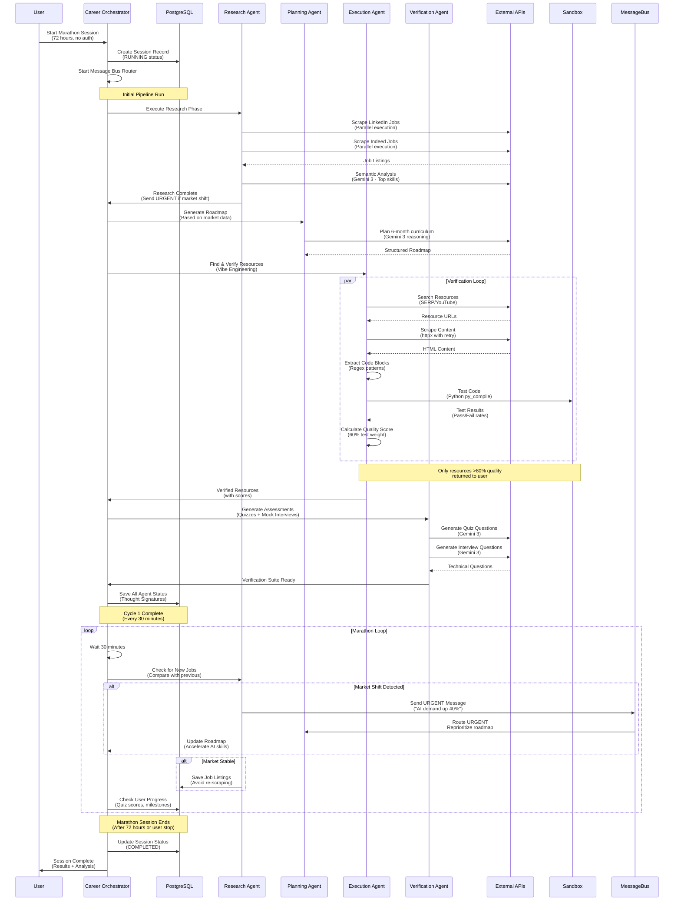
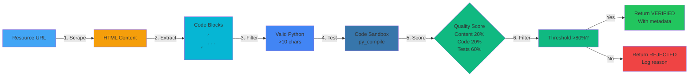
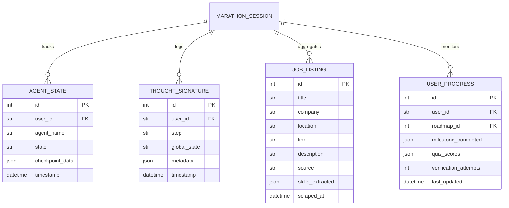

# Kazira - Autonomous Career Agent Architecture

## System Overview

```
User (No Auth Required)
        ↓
┌─────────────────────────────────────────┐
│     CAREER ORCHESTRATOR          │
│   (Marathon Session Manager)        │
└──────────────┬──────────────────────┘
               │
               ├──────────────────────────────────────┐
               │                                     │
    ┌──────────┴──────────┐              ┌───┴──────────┐
    │  AGENT MESSAGE BUS  │              │   DATABASE     │
    │  (Async Queue)     │              │  PostgreSQL   │
    └──────────┬───────────┘              └───────┬───────┘
               │                                   │
    ┌──────────┼──────────┬──────────┐            │
    │          │          │          │            │
┌───┴───┐  ┌───┴───┐  ┌───┴───┐    │
│RESEARCH  │  │PLANNING│  │EXECUTION│    │
│AGENT    │  │AGENT   │  │AGENT   │    │
└────┬────┘  └────┬────┘  └────┬────┘    │
     │              │              │            │
     │              │              │            │
┌────┴──────────────┬────┴──────┬────────┴────┐
│                   │              │             │
│EXTERNAL APIS      │  GEMINI 3     │
│                   │  (Core AI)     │
└─────────┬─────────┴─────┬─────────────┘
          │                  │
┌─────────┴──────────┬──────────┐
│  JOB BOARDS       │  CODE     │
│  (Scrapers)       │  SANDBOX  │
│                   │           │
└────────────────────┴───────────┘
```

## Detailed Component Diagram

```mermaid
graph TB
    User[User<br/>(No Auth)]
    
    subgraph Frontend
        Frontend[Next.js + React]
        NewOrchestrator[Orchestrator UI]
        AgentProgress[Agent Progress<br/>Real-time Display]
        ExecutionView[Execution View<br/>Daily Tasks]
    end
    
    subgraph Backend
        Main[FastAPI Server]
        
        subgraph Orchestrator
            Orchestrator[Career Orchestrator<br/>Marathon Agent]
            
            subgraph Agents
                Research[Research Agent<br/>Job Scraping]
                Planning[Planning Agent<br/>Roadmap Generation]
                Execution[Execution Agent<br/>Resource Verification]
                Verification[Verification Agent<br/>Quizzes & Assessment]
            end
            
            MessageBus[Agent Message Bus<br/>Dynamic Negotiation]
            SessionManager[Marathon Session<br/>72h Continuous]
        end
        
        Database[(PostgreSQL)<br/>State Persistence]
    end
    
    subgraph External
        LinkedIn[LinkedIn Jobs<br/>Selenium Scraping]
        Indeed[Indeed Jobs<br/>Selenium Scraping]
        Gemini3[Gemini 3<br/>Flash Preview]
        Sandbox[Code Sandbox<br/>Python Testing]
    end
    
    User -->|Submit Goal| Frontend
    Frontend -->|API Calls| Main
    Main -->|Orchestrates| Orchestrator
    Orchestrator -->|Message Bus| MessageBus
    MessageBus -->|Dynamic Routing| Research
    MessageBus -->|Dynamic Routing| Planning
    MessageBus -->|Dynamic Routing| Execution
    MessageBus -->|Dynamic Routing| Verification
    
    Research -->|Scrapes Real-time| LinkedIn
    Research -->|Scrapes Real-time| Indeed
    Research -->|Semantic Analysis| Gemini3
    Planning -->|Generates| Gemini3
    Execution -->|Finds Resources| Gemini3
    Execution -->|Tests Code| Sandbox
    Verification -->|Generates Quizzes| Gemini3
    
    Orchestrator -->|Persists State| Database
    Research -->|Saves Job Listings| Database
    Planning -->|Saves Roadmap| Database
    Execution -->|Saves Verified Resources| Database
    Verification -->|Saves Progress| Database
    MessageBus -->|Logs Messages| Database
    
    Frontend -->|Displays Progress| AgentProgress
    Frontend -->|Shows Tasks| ExecutionView
    
    style User fill:#e1f5fe
    style Frontend fill:#42a5f5
    style Backend fill:#06b6d4
    style Orchestrator fill:#0891b2
    style Database fill:#0284c7
    style External fill:#f59e0b
    style LinkedIn fill:#0077b5
    style Indeed fill:#ffffff
    style Gemini3 fill:#4285f4
    style Sandbox fill:#3776ab
```

## Marathon Agent Flow (72-Hour Session)



## Data Flow: Vibe Engineering (Autonomous Verification)



## Database Schema



## Technology Stack

### Frontend
- **Framework**: Next.js 16 (React 19)
- **Styling**: Tailwind CSS v4
- **Animations**: Framer Motion 12
- **Icons**: Lucide React
- **State Management**: React Hooks (LocalStorage for demo)

### Backend
- **Framework**: FastAPI (Python 3.11)
- **ORM**: SQLModel + SQLAlchemy
- **Database**: PostgreSQL (for production demo)
- **Async Runtime**: asyncio

### Agents
- **Orchestrator**: Custom marathon scheduler
- **Research**: Selenium scrapers + BeautifulSoup
- **Planning**: Gemini 3 Flash Preview
- **Execution**: httpx scraping + Python sandbox
- **Verification**: Gemini 3 Flash Preview

### External Integrations
- **Job Boards**: LinkedIn, Indeed (Selenium)
- **AI Engine**: Google Gemini 3 Flash Preview
- **Database**: PostgreSQL (asyncpg driver)

### Key Features Implemented

1. **Marathon Agent Mode** ✅
   - 72-hour continuous operation
   - 30-minute check intervals
   - Auto-restart on failure
   - Thought signature persistence

2. **Autonomous Verification (Vibe Engineering)** ✅
   - Code extraction from HTML
   - Sandbox testing (py_compile)
   - Quality scoring (content + code + tests)
   - 80% threshold filtering

3. **Agent Negotiation** ✅
   - Message bus architecture
   - URGENT/CRITICAL priorities
   - Dynamic routing
   - Market shift detection

4. **Database Persistence** ✅
   - PostgreSQL models
   - Agent state tracking
   - Marathon session management
   - Job listing caching
   - User progress monitoring

5. **Real Data (No Mocks)** ✅
   - Actual LinkedIn/Indeed scraping
   - Real Gemini 3 API calls
   - Retry logic with exponential backoff
   - Graceful failure handling

6. **No Authentication Required** ✅
   - Anonymous user sessions
   - Session-based IDs
   - LocalStorage for frontend
   - Perfect for hackathon demo
